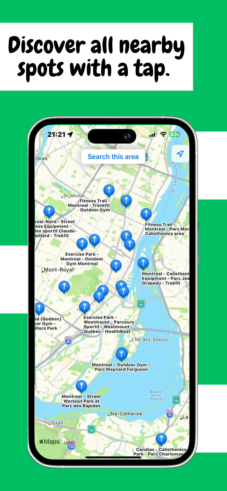
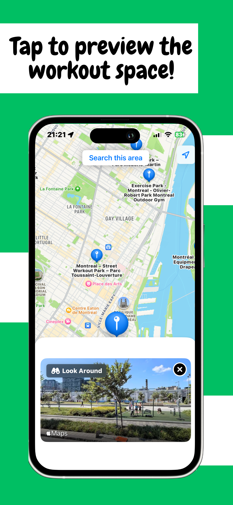

# SweatSpots

SweatSpots is an iOS app that helps users discover outdoor gym spots.

  
  

## Features

- **Discover Gym Spots**: Explore outdoor gym spots using an intuitive map interface.
- **Detailed Views**: Click on a spot to get a detailed look around view.
- **Search Functionality**: Easily search for spots in a specific area.
- **User Friendly**: No need to create an account or provide personal data. Just install and start exploring!

## Requirements

- **iOS**: 17.0 or later
- Xcode 15.0 or later
- [Firebase](https://firebase.google.com/): This project uses Firebase as a backend. Please download your own `GoogleService-Info.plist` file from the Firebase Console and add it to the project to get it up and running.

## Tech Stack

- **Language**: Swift
- **Frameworks**: SwiftUI, MapKit, CoreLocation, Firebase, FirebaseFirestore

## Getting Started

1. Clone this repository.
2. Run `pod install` to install the required CocoaPods.
3. Download your `GoogleService-Info.plist` from your Firebase project and add it to the Xcode project.
4. Build and run the project in Xcode.

## Privacy

SweatSpots respects user privacy:
- **No Data Collection**: The app doesn't collect or store personal data.
- **No Account Creation**: Users don't need to create an account to use the app.
- **No Uploads**: Users cannot upload posts, photos, or comments.

## Additional Resources
- [Privacy Policy](https://ludocourbin.github.io/SweatSpots/)
